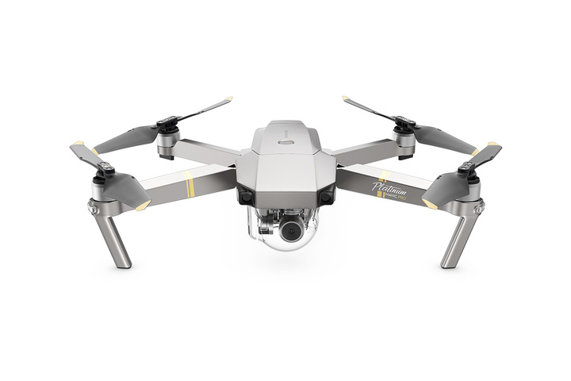

# Drones

There are several automatic drones that fly around London and report on traffic conditions. When a drone flies over a tube station, it assesses what the traffic condition is like in the area, and reports on it. A monitoring tool keeps track of the drones, processing all the emitted data to finally create two reports at the end of the day.

## User Stories

1. As a user I want to see the complete list of drones with their basic information (name, battery level, age, image).
2. As a user I want to review the data reported by each drone (time, speed, latitude, longitud, traffic conditions).

## Use

Install dependencies : `yarn install`

Run : `yarn start`

